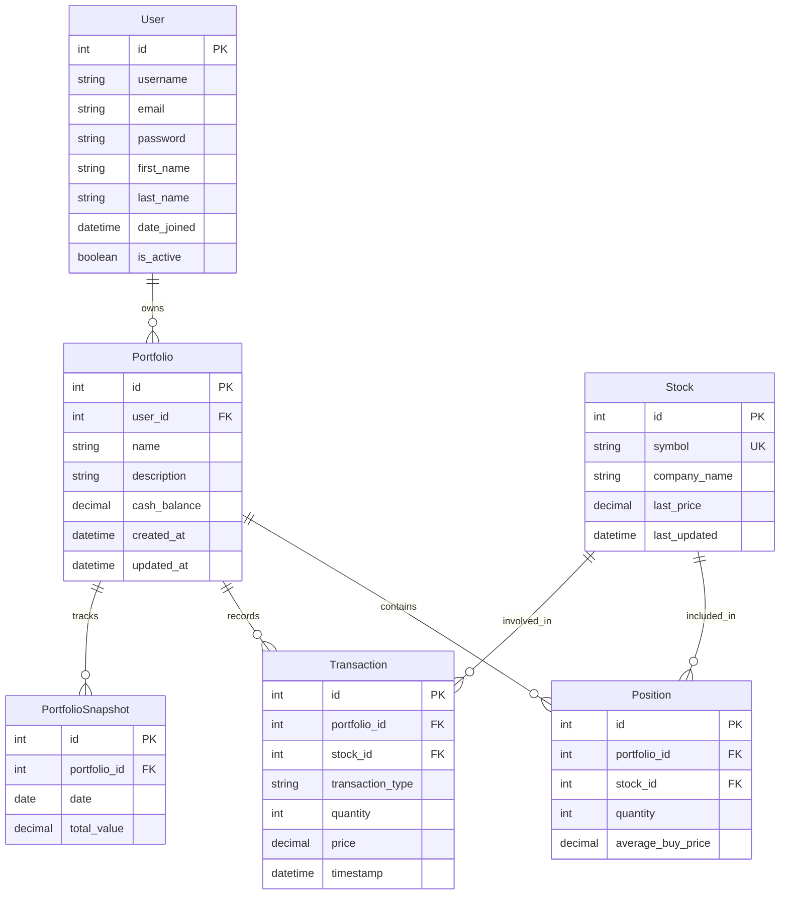

create a backend api using Python Django with the following specifications:

Virtual Stock Trading Platform API
Description: Develop an API that simulates stock trading, allowing users to practice trading stocks with real-time market data. Users can create portfolios, place buy/sell orders, and track historical performance.

Requirements:
1. CRUD operations for user accounts and portfolio management.
2. Endpoint for fetching real-time stock prices (integrate with a public stock market API like Alpha Vantage or Yahoo Finance).
3. Endpoint for placing buy/sell orders and calculating portfolio value.
4. Historical performance tracking for portfolios.
5. Use Django ORM for database interactions.
6. Deploy the API on Heroku or PythonAnywhere.

Key Features:
* Create static files such as a base html template for the home view, registration, login and logout etc to match the project requirements. Also create css for styling and js files.
* User Authentication: Develop a comprehensive user authentication system, including registration, login and logout.
* Portfolio Management: Only registered Users can add stocks to their portfolio and view aggregated values. The Portfolio managemnent page inherits from the base html template
* Real-Time Data Integration: Fetch live stock prices using external APIs. Registered users can view this feature on watchlist view or page which inherits from the base html template.
* Transaction History: Track all buy/sell transactions for analysis.
* Performance Analytics: Provide insights into portfolio growth over time.
This project is ideal for those looking to explore financial APIs and implement complex data handling while offering a unique learning experience in backend development.

 

## Core Features:

### 1. User Authentication & Portfolio Management

* CRUD operations for portfolios
* Multiple portfolios per user
* Cash balance tracking for each portfolio

### 2. Stock Integration

* Real-time stock data via Alpha Vantage API
* Search functionality for stocks by symbol
* Automatic stock information retrieval and caching

### 3. Trading Operations

* Buy/sell endpoints with validation
* Position tracking with average purchase price
* Transaction history for audit purposes

### 4. Performance Analytics

* Daily portfolio snapshots for tracking growth
* Profit/loss calculations
* Portfolio composition analysis

### 5. Technical Implementation:

* __API Architecture__ : RESTful API using Django REST Framework
* __Data Models :__ Well-structured models for portfolios, stocks, positions, transactions, and historical snapshots
* __External Integration :__ Alpha Vantage API (free tier) for real-time stock data
* __Scheduled Tasks :__ Daily portfolio value snapshots using Celery
* __Security :__ Authentication and permission checks throughout

## Deployment Notes:

1. To deploy on Heroku or PythonAnywhere:

    * Create an account on your preferred platform
    * Set up a PostgreSQL database
    * Configure environment variables (including your Alpha Vantage API key)
    * Deploy the code from your repository

2. Before deploying, be sure to:

    * Replace 'YOUR_API_KEY' with your actual Alpha Vantage API key
    * Set up proper CORS headers for your frontend
    * Configure proper SECRET_KEY and DEBUG settings for production

 

# Project Structure
virtual_stock_trading/
│
├── api/
│   ├── __init__.py
│   ├── admin.py
│   ├── apps.py
│   ├── models.py
│   ├── serializers.py
│   ├── views.py
│   ├── urls.py
│   └── services/
│       ├── __init__.py
│       └── stock_service.py
│
├── virtual_stock_trading/
│   ├── __init__.py
│   ├── asgi.py
│   ├── settings.py
│   ├── urls.py
│   └── wsgi.py
│
├── manage.py
└── requirements.txt

